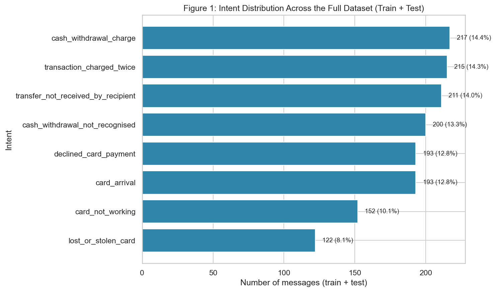
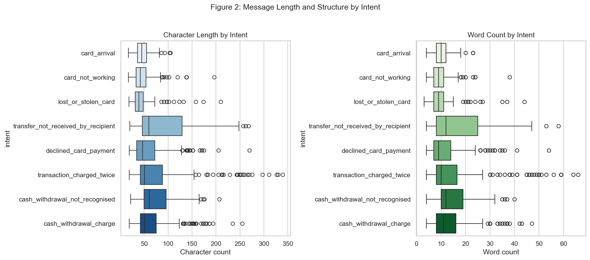
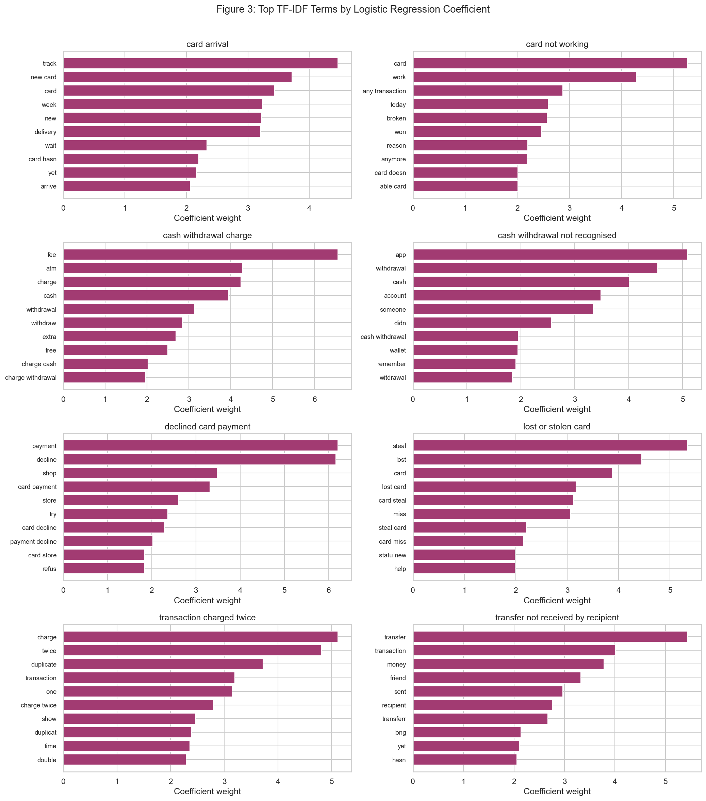
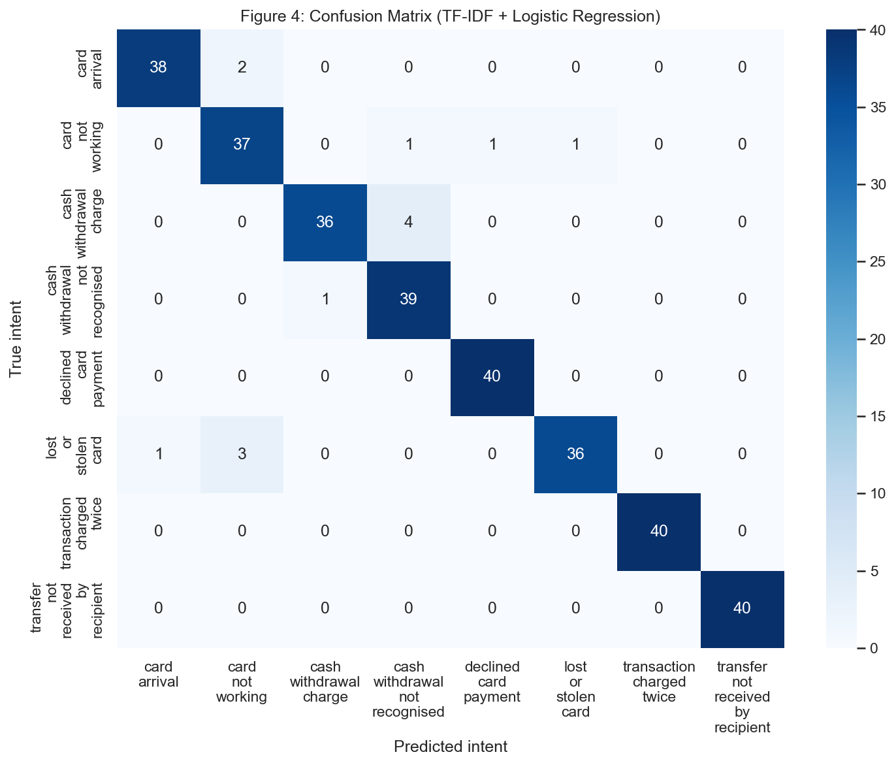
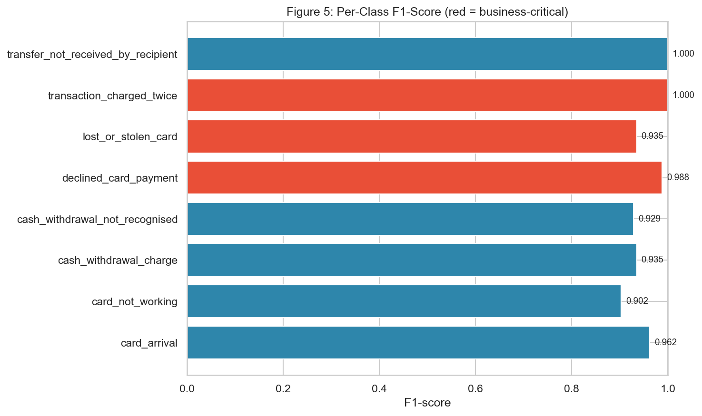
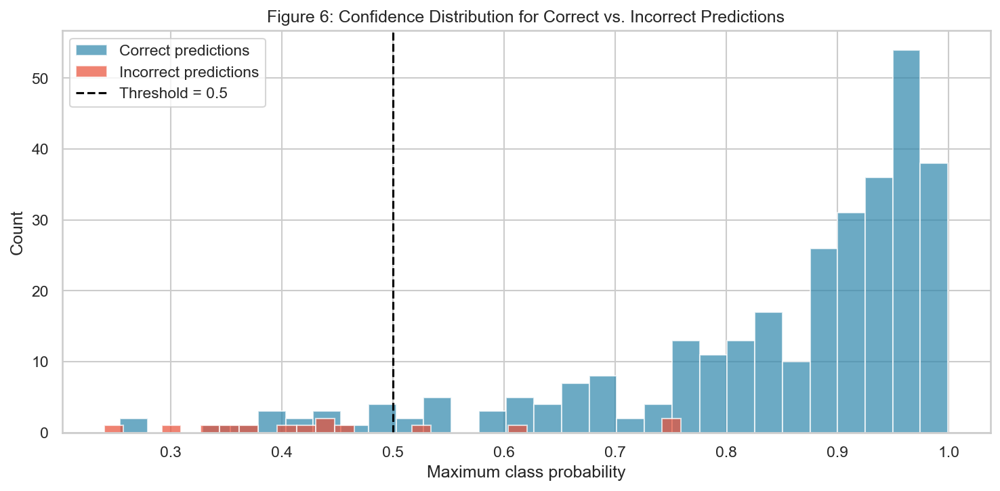

# AI Customer Support Ticket Classifier

## Intent Detection and Automatic Ticket Routing for Financial Services

---

## Project Title

**AI Customer Support Ticket Classifier — Intent Detection and Ticket Routing with NLP**

A financial-services AI/NLP team project: build a small, interpretable NLP prototype that predicts the intent of a new customer message and supports automatic ticket routing.

---

## Business Problem

A customer-support team receives a high volume of text requests every day — card issues, transaction disputes, transfer failures, and more. Agents currently read each message manually and route it to the appropriate support category. This manual triage is:

- **Slow** — every ticket needs a human read before any agent starts working on the actual issue.
- **Error-prone** — sensitive tickets (e.g., a stolen card report) can be misrouted, delaying urgent responses and increasing fraud exposure.
- **Expensive** — skilled agents spend time on repetitive classification instead of resolving issues.

This project builds a **small, interpretable NLP prototype** that predicts the intent of a new customer message and supports automatic ticket routing. It is **not** a chatbot, not a RAG system, and uses classical NLP (TF-IDF + Logistic Regression) — no transformer models, vector databases, or multi-agent frameworks.

---

## Dataset

This project uses the **BANKING77** dataset, a public English-language benchmark for fine-grained online-banking intent classification.

| Item | Detail |
|------|--------|
| **Dataset** | [BANKING77](https://huggingface.co/datasets/PolyAI/banking77) |
| **Original repository** | [PolyAI task-specific-datasets](https://github.com/PolyAI-LDN/task-specific-datasets) |
| **Original train CSV** | [banking_data/train.csv](https://github.com/PolyAI-LDN/task-specific-datasets/blob/master/banking_data/train.csv) |
| **Research paper** | [Casanueva et al., 2020](https://arxiv.org/abs/2003.04807) |
| **License** | CC BY 4.0 |
| **Full size** | 13,083 queries across 77 intents (10,003 train / 3,080 test) |
| **Project subset** | 8 intents, 1,183 training / 320 test examples |

### Selected Intents

| Intent | Domain | Why included |
|--------|--------|-------------|
| `card_arrival` | Card delivery | Common post-issuance query |
| `card_not_working` | Card malfunction | Functional failure report |
| `cash_withdrawal_not_recognised` | Fraud/unauthorized | Security-sensitive |
| `declined_card_payment` | Payment failure | Point-of-sale urgency |
| `lost_or_stolen_card` | Security | Highest-stakes routing |
| `transaction_charged_twice` | Billing dispute | Financial loss |
| `transfer_not_received_by_recipient` | Transfer failure | Cross-account issue |
| `cash_withdrawal_charge` | Fees | Fee-related queries |

The official 10,003 / 3,080 train/test assignment is preserved — the subset is a filter, not a re-split. See `data/README.md` for details.

---

## Methodology

```
Data loading → intent subset selection → text preprocessing (7 stages)
→ EDA (intent distribution, message length) → keyword baseline
→ TF-IDF + Logistic Regression (scikit-learn Pipeline)
→ hyperparameter tuning (GridSearchCV, stratified 5-fold CV)
→ evaluation (Precision/Recall/F1, Macro-F1, confusion matrix)
→ error analysis (all 14 errors inspected)
→ prediction function → confidence-based human-deferral rule
```

**Reproducibility:** A fixed random seed (`42`) is used for the train/test sampling steps, cross-validation splits, and the model. Code is designed to run cleanly from top to bottom.

### Text Preprocessing Pipeline

A 7-stage preprocessing pipeline is applied to all messages before vectorization:

1. **Lowercasing** — normalize case variations
2. **Whitespace normalization** — strip extra spaces
3. **Punctuation removal** — remove non-alphanumeric characters
4. **Tokenization** — split into word tokens
5. **Contraction expansion** — `dont` → `do not` (preserves negation tokens)
6. **Stopword removal** — remove 170+ common English stopwords
7. **Lemmatization** — reduce words to base form (`cards` → `card`, `charged` → `charge`)

The `preprocess_text()` function in `src/predict.py` is self-contained (no external NLTK data downloads) and is used consistently in training and inference, so there is no train/serve preprocessing mismatch.

---

## EDA Findings

### Q1 — Intent Distribution

Across the full dataset (1,503 messages: 1,183 training + 320 test), `cash_withdrawal_charge` (14.4%), `transaction_charged_twice` (14.3%) and `transfer_not_received_by_recipient` (14.0%) are the largest classes; `lost_or_stolen_card` (8.1%) is the smallest. Routing capacity should be sized to handle fee/dispute and transfer intents in roughly equal volume.



### Q2 — Message Length by Intent

Transfer-related and duplicate-charge messages tend to be longer (mean ~84–92 characters), while card-arrival and lost-card messages are shorter (~47–49 characters). Distributions overlap substantially, so length alone is not a reliable routing signal.



### Q3 — Top TF-IDF Terms

Logistic Regression coefficients show each intent has distinctive terms (e.g., `fee`, `atm` for `cash_withdrawal_charge`; `steal`, `lost` for `lost_or_stolen_card`), offering an interpretable view of why the model routes a message the way it does.



---

## Baseline: Keyword Rule System

A simple rule-based baseline maps hand-picked phrases (e.g., `charged twice`, `stolen`) to intents.

| Metric | Value |
|--------|-------|
| Coverage | ~35% of test messages |
| Accuracy on covered messages | ~89% |
| Uncovered messages | ~208 / 320 |

**Where it succeeds:** Messages with explicit, unambiguous phrases like "charged twice" or "my card was stolen".

**Where it fails:** Paraphrases, spelling variants, multi-intent messages, and the ~65% of messages where no rule fires. This motivates machine learning, which learns broader n-gram patterns than hand-crafted rules.

---

## Model: TF-IDF + Logistic Regression

```python
Pipeline([
    ("tfidf", TfidfVectorizer(lowercase=False, ngram_range=(1,2), ...)),
    ("clf", LogisticRegression(max_iter=2000, class_weight="balanced", ...)),
])
```

- **No data leakage:** the vectorizer is fitted **only on training data** inside the `Pipeline`; the test set is transformed, not re-fitted.
- **Hyperparameter tuning:** `GridSearchCV` over 216 configurations with stratified 5-fold cross-validation, scoring on Macro-F1.
- **Best configuration:** `C=5.0`, `ngram_range=(1,2)`, `min_df=1`, `max_df=0.9`, `sublinear_tf=True`, `stop_words=None`.
- Text is preprocessed before the pipeline; the vectorizer uses `lowercase=False` because lowercasing is already applied. The full reproducible workflow is in `src/predict.py`.

---

## Evaluation

| Metric | Value |
|--------|-------|
| **Macro-F1 (test)** | 0.956 |
| **Accuracy (test)** | 0.956 |
| **Best CV Macro-F1** | 0.938 |
| Lowest per-class F1 | `card_not_working` (0.90) |
| Highest per-class F1 | `transaction_charged_twice` / `transfer_not_received_by_recipient` (1.00) |





### Which intents are confused?

Top confused pairs: `cash_withdrawal_charge` → `cash_withdrawal_not_recognised` (4), `lost_or_stolen_card` → `card_not_working` (3), `card_arrival` → `card_not_working` (2). Common causes are shared vocabulary around "card", "charge", and "withdrawal", plus vague failure reports with no explicit keywords.

---

## Error Analysis

The model achieves ~96% accuracy, producing only **14 errors on 320 test examples**. The project specification asks for at least 20 errors to be inspected; this cannot be fully met because 20 incorrect predictions do not exist in the test set — all 14 available errors were manually inspected and tabulated (see the notebook).

**Patterns observed:**
1. **Semantic overlap** — `card_arrival` vs `lost_or_stolen_card`: customers say "locate my card" / "can't find my card" in both contexts.
2. **Vague failure reports** — `card_not_working` messages without explicit failure keywords default to nearby classes.
3. **Sibling intent confusion** — `cash_withdrawal_charge` vs `cash_withdrawal_not_recognised` share the vocabulary "charge/cash/withdrawal".
4. **Low confidence signals** — 10 of the 14 errors (71%) have confidence below 0.5, so the human-review rule catches most of them.
5. **Preprocessing effects** — lemmatization helps normalize word forms but occasionally removes useful signal.

---

## Business Implications

### Q6 — Are all errors equally costly?

| Intent | Priority metric | Why |
|--------|-----------------|-----|
| `lost_or_stolen_card` | **Recall** | A missed stolen-card report delays blocking and increases fraud exposure. |
| `declined_card_payment` | **Recall** | Customers stuck at point of sale need fast help. |
| `transaction_charged_twice` | **Precision** | False positives waste time of specialized dispute agents. |

In production these trade-offs can be formalized with a **cost matrix** or **class-specific decision thresholds**.

### Q8 — When should the system defer to a human?

**Rule:** route to a human agent when top-class confidence < **0.5**.

**Why 0.5:** with 8 possible intents, a confidence below 0.5 means the winning class holds less than half the probability mass — several intents are still plausible, so the prediction is genuinely ambiguous. On the test set this rule defers only **27 / 320 (8.4%)** of messages while catching **10 of the 14 errors (71%)**. A looser 0.35 threshold catches only 3 of the 14 errors (21%).



**Limitations of the rule:** the threshold is dataset-specific; high-confidence wrong predictions still slip through; out-of-scope and multi-intent messages are not detected; business-critical intents may deserve always-escalate rules regardless of confidence.

---

## Limitations

- **Prototype, not production-ready** — no monitoring, logging, or continuous evaluation.
- **Limited scope:** only 8 of the 77 BANKING77 intents.
- **English-only:** cannot generalize to other languages.
- **No deep contextual understanding:** TF-IDF cannot capture long-range dependencies or paraphrases that share no words.
- **Closed-set classifier:** forces predictions into 8 known categories; unrelated messages are misclassified.
- **Uncalibrated probabilities:** `predict_proba` is a raw model score, not a calibrated probability.
- **Preprocessing trade-offs:** stopword removal and lemmatization occasionally remove useful signal.
- **Small test set:** 320 examples mean evaluation metrics have relatively high variance.
- **Rule thresholds:** the human-deferral confidence threshold is dataset-specific, not tuned on live traffic.

---

## Repository Structure

```
customer-support-ticket-classifier/
├── README.md                  # This document
├── requirements.txt           # Pinned Python dependencies
├── .gitignore
├── notebooks/
│   └── analysis.ipynb         # Full Q1–Q8 analysis, figures, error analysis
├── src/
│   └── predict.py             # Single self-contained file: preprocessing,
│                              # data loading, training, evaluation, error
│                              # analysis, saving and prediction (sections [1]-[8])
├── app.py                     # Optional Streamlit demo
├── figures/                   # 6 PNG figures generated by the notebook
│   ├── 01_intent_distribution.png
│   ├── 02_message_length_by_intent.png
│   ├── 03_top_tfidf_terms.png
│   ├── 04_confusion_matrix.png
│   ├── 05_per_class_f1.png
│   └── 06_confidence_distribution.png
├── models/                    # Trained artifacts (created on first run)
│   ├── ticket_classifier.joblib
│   └── model_metadata.json
└── data/
    ├── README.md              # Dataset source, license, schema
    ├── train.csv              # 8-intent subset (1,183 examples)
    └── test.csv               # 8-intent subset (320 examples)
```

---

## Instructions for Running the Code

### 1. Install dependencies

```bash
pip install -r requirements.txt
```

### 2a. Run the full workflow from the command line (recommended)

`src/predict.py` contains the complete, sectioned workflow (data loading, preprocessing, training, evaluation, error analysis, saving, prediction):

```bash
python src/predict.py
```

This trains the model, evaluates it, saves `models/ticket_classifier.joblib` and `models/model_metadata.json`, and runs a prediction demo.

### 2b. Run the analysis notebook (interactive, generates figures)

```bash
jupyter notebook notebooks/analysis.ipynb
```

Run all cells top to bottom. This performs the EDA, baseline, training, evaluation, error analysis, and saves **all 6 figures** in `figures/`. It answers company questions Q1–Q8.

### 3. Use the prediction function

```python
from src.predict import predict_intent

result = predict_intent("My card was stolen, please cancel it.")
print(result["predicted_intent"], result["confidence"], result["needs_human_review"])
```

### 4. Run the Streamlit demo (optional)

```bash
streamlit run app.py
```

No prior setup is needed: the first launch auto-trains and saves the model
(a few minutes, cached afterwards), so every later launch loads instantly.

---

## Tools & Libraries

Python, pandas, NumPy, Matplotlib, seaborn, scikit-learn, joblib, Streamlit (optional). The notebook is Jupyter/IPython compatible and runs on Windows, Linux, macOS, or Colab.