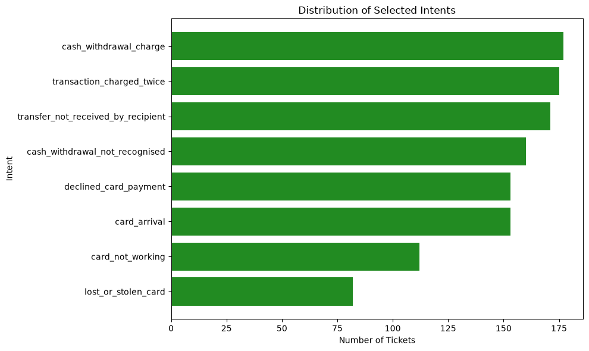
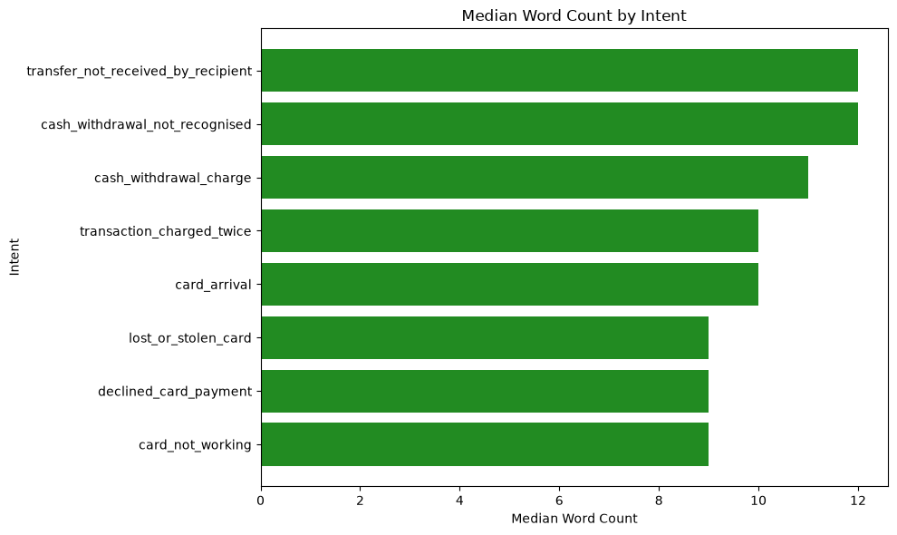
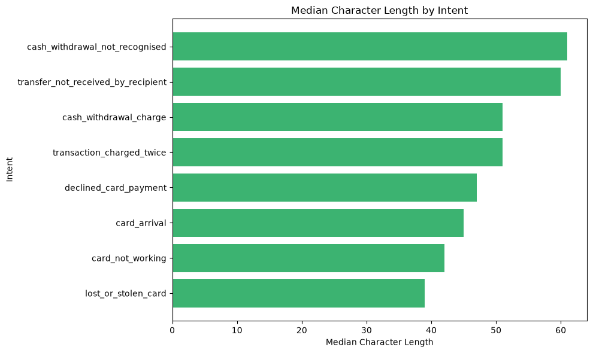
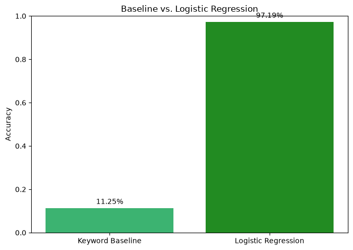
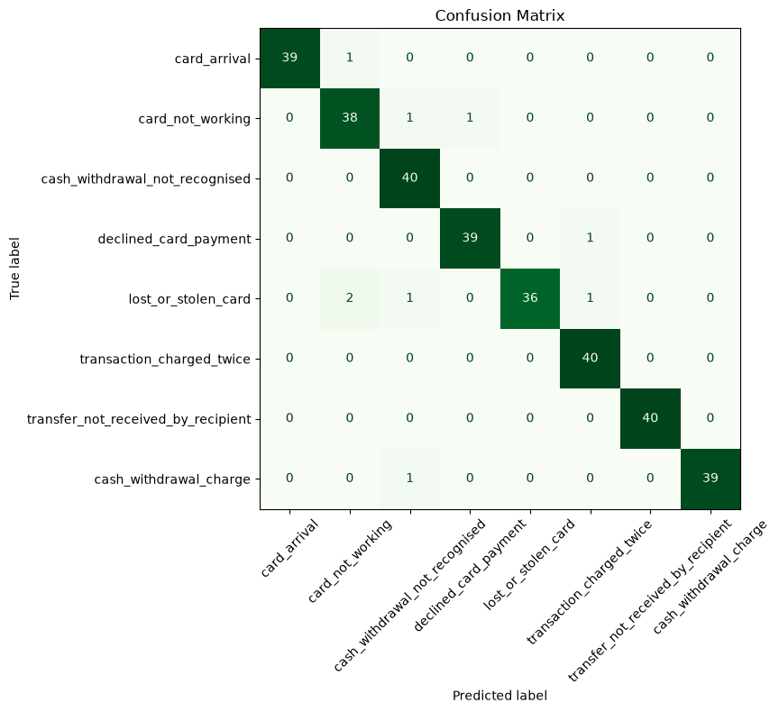
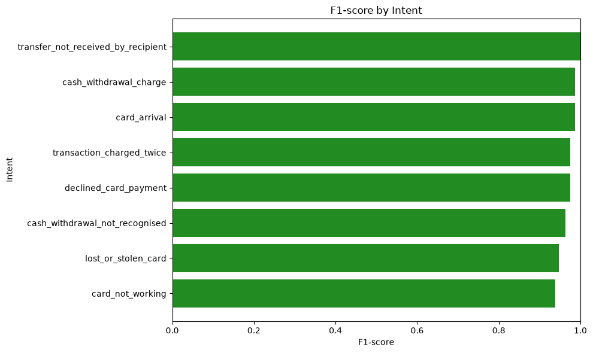

# AI Customer Support Ticket Classifier

An interpretable NLP prototype for automatically classifying banking customer-support messages into predefined intents and supporting automated ticket routing.

---

## 1. Business Problem

Customer-support teams receive a large number of text-based requests that are manually reviewed and routed to the appropriate support category.

The goal of this project is to build a lightweight and interpretable NLP system that can automatically identify the intent of a new customer message and support the ticket-routing process.

The project focuses on classical NLP and machine learning rather than chatbot or generative-AI approaches.

---

## 2. Dataset

This project uses the **BANKING77** dataset, a public English-language benchmark containing customer-service queries from the banking domain.

The original dataset contains **13,083 queries across 77 intents**. For this project, a focused subset of 8 intents was selected.

- **Dataset:** BANKING77
- **Source:** PolyAI
- **License:** CC BY 4.0

Dataset links:

- [Hugging Face – BANKING77](https://huggingface.co/datasets/PolyAI/banking77)
- [PolyAI GitHub Repository](https://github.com/PolyAI-LDN/task-specific-datasets)
- [Research Paper](https://arxiv.org/abs/2003.04807)

---

## 3. Selected Intents

Eight intents were selected manually to create a manageable multi-class classification problem:

- `card_arrival`
- `card_not_working`
- `cash_withdrawal_charge`
- `cash_withdrawal_not_recognised`
- `declined_card_payment`
- `lost_or_stolen_card`
- `transaction_charged_twice`
- `transfer_not_received_by_recipient`

The selected categories cover different types of banking-support requests, including card issues, cash withdrawals, payments, transactions, and transfers.

---

## 4. Methodology

The project follows a reproducible NLP workflow:

```text
Data Understanding
       ↓
Intent Selection
       ↓
Text EDA
       ↓
Train/Test Strategy
       ↓
Keyword Baseline
       ↓
TF-IDF
       ↓
Logistic Regression
       ↓
Evaluation
       ↓
Error Analysis
       ↓
Prediction + Confidence
       ↓
Human Review Rule
```

The final model is implemented using a scikit-learn Pipeline, combining TF-IDF feature extraction with Logistic Regression.

A fixed train/test setup is used, and text transformations are learned from the training data to avoid data leakage.

---

## 5. Exploratory Data Analysis

The selected dataset contains 1,183 training samples across 8 customer-support intents.

The training set is moderately imbalanced, with `cash_withdrawal_charge` and `transaction_charged_twice` among the most frequent intents, while `lost_or_stolen_card` and `card_not_working` have fewer training examples.

Two text-based features were also examined:

- Word count
- Character count

The median message length generally falls within a similar range across intents. Some intents, such as `transfer_not_received_by_recipient` and `cash_withdrawal_not_recognised`, tend to contain slightly longer messages, while intents such as `card_not_working` and `lost_or_stolen_card` tend to have shorter messages.

However, the distributions overlap substantially. This suggests that message length alone is not sufficient for reliable intent classification, but it can still provide useful descriptive information about the dataset.

The test set contains 40 samples per intent, providing a balanced basis for model evaluation.

### Intent Distribution



### Median Word Count by Intent



### Median Character Length by Intent



---

## 6. Keyword-Based Baseline

Before applying machine learning, a simple rule-based keyword classifier was implemented as a baseline.

The baseline identifies a small set of explicit phrases associated with the selected intents, for example:

- "charged twice" → `transaction_charged_twice`
- "cash withdrawal" + "not mine" → `cash_withdrawal_not_recognised`
- "card was stolen" → `lost_or_stolen_card`
- "payment was declined" → `declined_card_payment`

The keyword-based baseline achieved:

- Accuracy: **11.25%**
- Coverage: **11.25%**

The low coverage shows that simple keyword rules can identify some obvious cases, but they fail when customers express the same problem using different wording. The keyword-based baseline was intentionally kept simple, using a limited set of manually defined phrases. Therefore, its low performance mainly reflects the limited coverage of the rule set rather than the general limitations of rule-based classification.

This provides a useful baseline and demonstrates why a more flexible NLP-based classification approach is needed.

### Baseline vs. Machine Learning



---

## 7. TF-IDF + Logistic Regression

The main classifier uses a classical NLP pipeline combining **TF-IDF** feature extraction with **Logistic Regression**.

The workflow is:

Customer Message  
→ TF-IDF Vectorization  
→ Logistic Regression  
→ Predicted Intent

TF-IDF converts text into numerical features by assigning higher weights to terms that are informative within a message and less common across the overall corpus.

Logistic Regression then learns the relationship between these numerical text features and the target intents.

The final implementation uses a scikit-learn `Pipeline`, which combines TF-IDF and Logistic Regression into a single reproducible workflow.

This approach also helps prevent data leakage because the TF-IDF transformation is fitted only on the training data before being applied to the test data.

The model was selected because it provides a strong and interpretable classical NLP baseline while remaining relatively simple, efficient, and suitable for a small text-classification prototype. 

---

## 8. Evaluation

The final TF-IDF + Logistic Regression model was evaluated on the held-out test set.

The test set contains 320 samples, with 40 samples per intent.

### Overall Performance

| Metric | Score |
|---|---:|
| Accuracy | **97.19%** |
| Weighted Precision | **97.31%** |
| Weighted Recall | **97.19%** |
| Weighted F1-score | **97.18%** |
| Macro-F1 | **97.20%** |

The model correctly classified 311 out of 320 test messages, resulting in only 9 incorrect predictions.

The high Macro-F1 score indicates that the model performs consistently well across the selected intents rather than achieving a high score mainly because of a few dominant classes.

The confusion matrix and per-class F1-score provide additional detail about class-level performance.

### Confusion Matrix



### Per-Class F1-Score



---

## 9. Error Analysis

A manual inspection of the model's incorrect predictions was performed to understand where the classifier struggles.

The model produced **9 incorrect predictions out of 320 test samples**.

Most errors occurred between intents with closely related language or overlapping customer scenarios. For example:

- `card_arrival` vs. `card_not_working`
- `card_not_working` vs. `declined_card_payment`
- `lost_or_stolen_card` vs. other card-related intents
- `cash_withdrawal_charge` vs. `cash_withdrawal_not_recognised`
- `declined_card_payment` vs. `transaction_charged_twice`

These errors often occur when a short customer message does not contain enough contextual information to clearly distinguish between two related intents.

For example, messages mentioning a missing, stolen, blocked, or unusable card may contain similar vocabulary while referring to different underlying problems.

This suggests that improving performance further may require richer contextual information, more training examples for ambiguous cases, or more advanced NLP methods.

---

## 10. Business Implications

The classifier can support customer-support teams by automatically routing incoming messages to the appropriate support category.

With **97.19% accuracy** and **97.20% Macro-F1** on the selected test set, the prototype demonstrates that classical NLP can provide effective automated intent classification for this subset of banking support requests.

However, not all classification errors have the same business impact.

Three business-critical intents were given particular attention:

- `lost_or_stolen_card`
- `cash_withdrawal_not_recognised`
- `declined_card_payment`

Incorrect routing for these categories may have greater operational consequences because they can involve security concerns, unauthorized transactions, or customers being unable to complete payments.

For such cases, Recall is particularly important because missing a genuinely critical request may be more costly than incorrectly routing an ordinary request.

The confidence-based human-review mechanism provides an additional safeguard by allowing predictions with confidence below 0.80 to be reviewed manually instead of being fully automated.

---

## 11. Limitations

This project is a small NLP prototype and should not be considered production-ready.

The main limitations are:

- Only **8 of the 77 BANKING77 intents** were used.
- The dataset consists of English-language banking queries and may not represent other domains or languages.
- The training data is moderately imbalanced across the selected intents.
- Some intents contain semantically similar or ambiguous messages, which can lead to misclassification.
- The confidence score is used as an operational signal and has not been formally calibrated.
- The human-review threshold of **80%** is an initial rule rather than a universally optimal threshold.
- The evaluation is based on a fixed test set and may not fully represent future real-world customer messages.
- The keyword baseline is intentionally simple and is only used as a reference point.

Further improvements could include collecting more representative training data, calibrating prediction confidence, tuning the decision threshold based on business costs, and evaluating the system on real-world support messages.

---

## 12. Repository Structure

The project is organized into separate directories for documentation, analysis, reusable prediction code, visualizations, and dataset-related files.

```text
customer-support-ticket-classifier/
│
├── README.md
├── requirements.txt
├── model.pkl
├── answering_business_questions.pdf
│
├── notebooks/
│   └── customer_support_ticket_classifier.ipynb
│
├── src/
│   └── predict.py
│
├── figures/
│   ├── intent_distribution.png
│   ├── median_word_count_by_intent.png
│   ├── median_character_length_by_intent.png
│   ├── baseline_vs_LR.png
│   ├── confusion_matrix.png
│   ├── per_class_f1.png
│   └── top_tfidf_terms.png
│
└── data/
    ├── train.csv
    └── test.csv
```

### Directory Overview:

notebooks/ — Contains the main analysis notebook, including data exploration, preprocessing, model training, evaluation, error analysis, and visualizations.

src/ — Contains reusable prediction code for loading the trained model and classifying new customer-support messages.

figures/ — Contains the visualizations generated during the analysis.

data/ — data/ — Contains the training and test datasets used in the project.

model.pkl — Contains the trained TF-IDF + Logistic Regression pipeline used by the prediction script.

requirements.txt — Lists the Python dependencies required to run the project.

README.md — Provides an overview of the project, methodology, results, repository structure, and usage instructions.

answering_business_questions.pdf — ansering the business questions about the project
---

## 13. How to Run

### 1. Clone the repository

```bash
git clone <repository-url>
cd customer-support-ticket-classifier
```

### 2. Install the required dependencies

It is recommended to use a virtual environment.

```bash
python -m venv .venv
```

Activate the virtual environment:

**Windows:**

```bash
.venv\Scripts\activate
```

**macOS / Linux:**

```bash
source .venv/bin/activate
```

Then install the required packages:

```bash
pip install -r requirements.txt
```

### 3. Prepare the dataset

The required training and test datasets are already included in the `data/` directory:

```text
data/
├── train.csv
└── test.csv
```

The datasets contain the selected subset of 8 BANKING77 intents used in this project.

### 4. Run the analysis notebook

Open the main notebook:

```text
notebooks/customer_support_ticket_classifier.ipynb
```

Run the cells from top to bottom to reproduce the data analysis, exploratory analysis, model training, evaluation, error analysis, and prediction experiments.

The notebook contains the complete training workflow based on a scikit-learn Pipeline combining TF-IDF vectorization and Logistic Regression.

### 5. Run the prediction script

After the trained model has been saved, the classifier can be used through:

```text
src/predict.py
```

The prediction script accepts a new customer-support message and returns:

- The predicted intent
- The model confidence
- The recommended decision

Predictions with confidence below 80% are flagged for human review, while predictions with confidence of 80% or higher are treated as suitable for automatic classification.

To run the prediction script:

```bash
python src/predict.py
```

Follow the instructions displayed by the script to enter a customer-support message and obtain its predicted intent.
---

## Developed by

*** Narges Sabbagh *** 